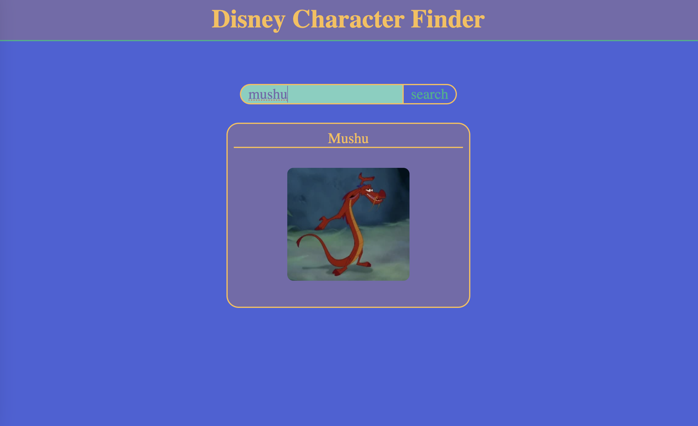
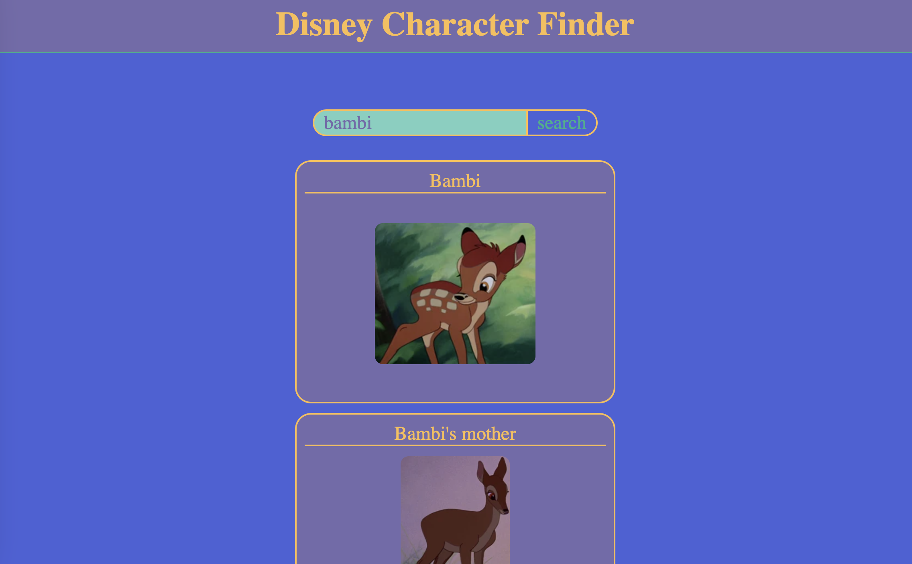

# Disney Character Finder Exercise

For this coding warm-up you will be required to:
- add the code for the fetch. Check the [API Docs](https://disneyapi.dev/docs/)
- add the search bar functionality

Bonus: customize the CSS and/or display the movies associated with each character

Fetches and therefore search results may return one or more characters as displayed below. Take time to understand the API and the way it returns data.

